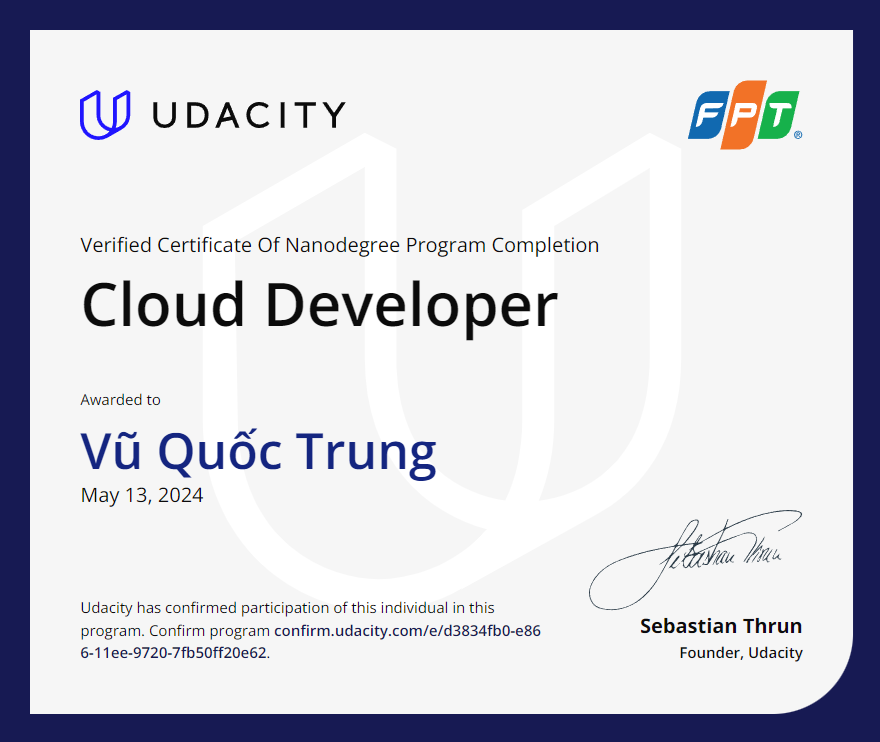
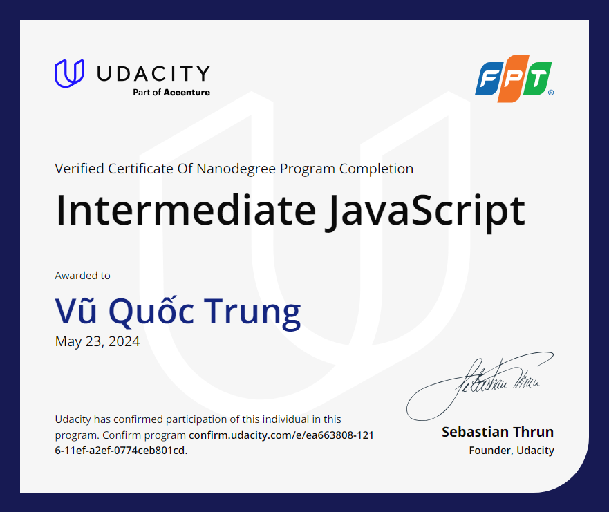
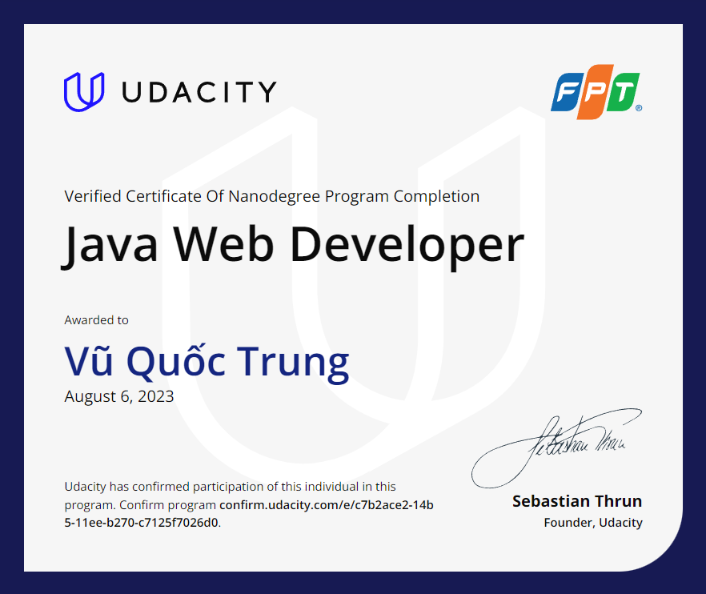
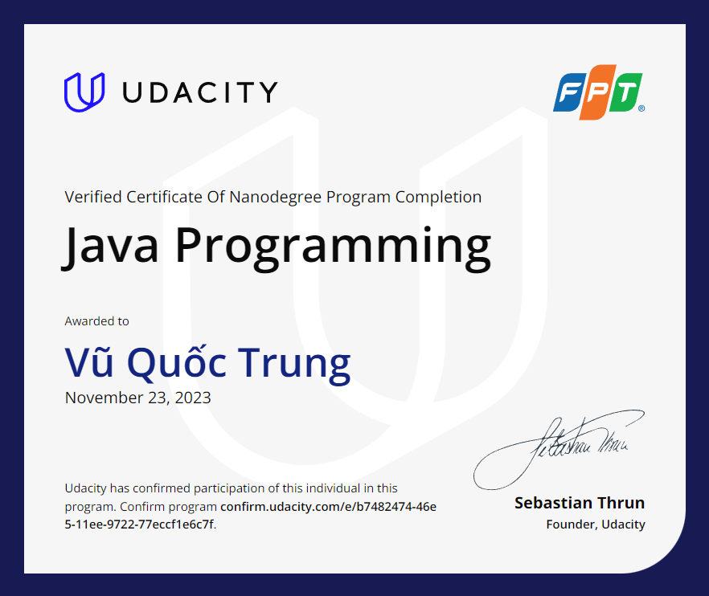
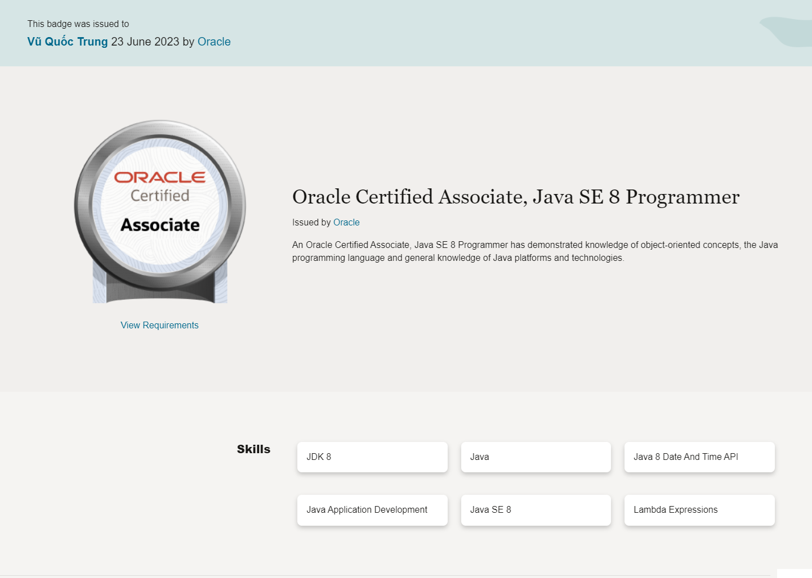

###  Personal info:
- Name: Vu Quoc Trung
- Education: FPT University - Software Engineering Major – Bachelor Degree

### :hammer_and_wrench: Skills :
| Languages and Tools 
| :---: |
| &nbsp;  
|   
| &nbsp; &nbsp; 
| &nbsp; 
| &nbsp; &nbsp; &nbsp; 
| &nbsp; &nbsp; &nbsp; 
| &nbsp; &nbsp; 
| &nbsp; &nbsp;
| &nbsp; 

---

---
### 🏅 Certificates:

    
    
    
    
    

<!--
I am a Full Stack Developer  from India.
- :telescope: I’m working as a Software Engineer and contributing to frontend and backend for building web applications.

- :seedling: Exploring Technical Content Writing.

- :zap: In my free time, I solve problems on GeeksforGeeks and read tech articles.

- :mailbox:How to reach me: 

**trungvq2511/trungvq2511** is a ✨ _special_ ✨ repository because its `README.md` (this file) appears on your GitHub profile.

Here are some ideas to get you started:

- 🔭 I’m currently working on ...
- 🌱 I’m currently learning ...
- 👯 I’m looking to collaborate on ...
- 🤔 I’m looking for help with ...
- 💬 Ask me about ...
- 📫 How to reach me: ...
- 😄 Pronouns: ...
- ⚡ Fun fact: ...
-->
